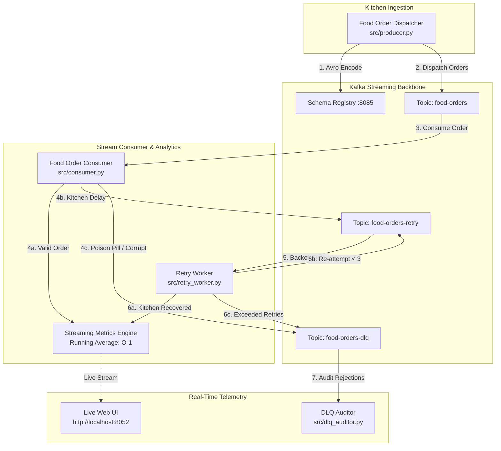

# GourmetExpress: Real-Time Food Order Stream Processing Pipeline
### Student Submission: Kavindu | Big Data Assignment Chapter 3

A distributed stream processing engine built with **Apache Kafka**, **Apache Avro**, and **Python**. The system simulates a food delivery cloud kitchen platform that produces culinary meal orders, computes real-time running average dish prices, isolates kitchen delay bottlenecks via retry queues with exponential backoff, and traps unserviceable poison orders in a Dead Letter Queue (DLQ).

---

## 🚀 Key Architectural Highlights

1. **Avro Serialization & Schema Registry Wire Format**:
   - Strictly conforms to `schemas/order.avsc` (`orderId`, `product`, `price`).
   - Prefixes payloads with the Confluent Schema Registry 5-byte framing (`0x00` magic byte + 4-byte big-endian schema ID).
2. **Real-Time Running Average Aggregator**:
   - Maintains continuous running average meal price ($\bar{P}_n = \frac{\sum P_i}{n}$) dynamically in $O(1)$ constant time upon every order receipt.
   - Computes minimum/maximum meal price, category distributions, and gross billing volume.
3. **Kitchen Retry Backoff (`food-orders-retry`)**:
   - Intercepts transient errors (kitchen line overload, courier timeout), attaches diagnostic headers (`x-retry-attempt`, `x-source-topic`, `x-delay-reason`), and backs off before re-processing.
4. **Dead Letter Queue (`food-orders-dlq`)**:
   - Quarantines unserviceable tickets (poison pills, invalid pricing, expired order tokens, or payloads exceeding 3 retry cycles) with diagnostic headers and stack traces.
5. **Interactive Telemetry Dashboard**:
   - Real-time glassmorphic emerald & amber web telemetry dashboard on `http://localhost:8052`.
   - Real-time Chart.js price velocity graph updating via WebSockets.
   - One-click interactive order dispatchers.

---

## 🏛️ System Architecture



---

## 📜 Food Order Schema (`order.avsc`)

Located in [schemas/order.avsc](schemas/order.avsc):

```json
{
  "type": "record",
  "name": "Order",
  "namespace": "com.kavindu.foodorder",
  "doc": "Food delivery purchase transaction schema for real-time Kafka stream processing",
  "fields": [
    {
      "name": "orderId",
      "type": "string",
      "doc": "Unique food order reference (e.g., '1001', '1002')"
    },
    {
      "name": "product",
      "type": "string",
      "doc": "Name of the purchased culinary dish or meal (e.g., 'Truffle Burger', 'Artisan Pizza')"
    },
    {
      "name": "price",
      "type": "float",
      "doc": "Total cost of the food order item"
    }
  ]
}
```

---

## ⚡ Quickstart & Execution Guide

### 1. Dependencies Installation
```powershell
pip install -r requirements.txt
```

### 2. Start Kafka Infrastructure (Docker)

> **Windows users**: Docker Desktop uses a named pipe — set `DOCKER_HOST` first.

```powershell
# Required for Windows Docker Desktop
$env:DOCKER_HOST = "npipe:////./pipe/dockerDesktopLinuxEngine"

# Start Kafka + Schema Registry + Kafka-UI
docker compose up -d
```

Wait ~15 seconds, then verify containers are running:
```powershell
$env:DOCKER_HOST = "npipe:////./pipe/dockerDesktopLinuxEngine"
docker ps
```

| Service | URL |
|---|---|
| Kafka Broker | `localhost:9094` |
| Schema Registry | `http://localhost:8086` |
| Kafka UI | `http://localhost:8092` |

### 3. Automated End-to-End Live Demonstration
Run the automated demonstration script:
```powershell
python run_live_demo.py
```
This executes:
- Topic verification (`food-orders`, `food-orders-retry`, `food-orders-dlq`).
- Producer dispatching 5 normal gourmet meal orders (updating running average).
- 2 transient kitchen delay orders (routed to retry queue with backoff and recovery).
- 2 permanent poison pill orders (routed directly to DLQ).
- 3 follow-up meal orders to prove continuous processing.
- Renders final terminal summary table and DLQ inspection report.

---

### 4. Component-by-Component CLI Execution

#### Start Consumer with Live Terminal Dashboard
```powershell
python -m src.consumer --live
```

#### Start Retry Worker
```powershell
python -m src.retry_worker
```

#### Dispatch Orders via CLI
```powershell
# Dispatch 10 normal orders
python -m src.producer --count 10

# Dispatch orders with kitchen delay simulation
python -m src.producer --count 5 --transient 2 4

# Dispatch orders with poison pill / corrupt bytes
python -m src.producer --count 5 --permanent 3 --corrupt 5
```

#### Audit Dead Letter Queue
```powershell
python -m src.dlq_auditor
```

---

### 5. Interactive Live Web Dashboard
Launch the web interface:
```powershell
python -m web.app
```
Open **[http://localhost:8052](http://localhost:8052)** in your browser:
- Real-time running average gauge and historical price chart via WebSockets.
- Interactive order buttons: "Dispatch 3 Gourmet Meals", "Simulate Kitchen Delay", "Inject Expired Ticket", and "Audit DLQ".

---

## 🧪 Unit Testing
Run the pytest test suite (no Docker required):
```powershell
pytest -v
```

Tests include:

- `test_food_schema_structure`: Confirms `order.avsc` conformance.
- `test_food_order_codec_roundtrip`: Validates binary encoding/decoding and wire format headers.
- `test_invalid_food_orders`: Checks missing fields and price constraints.
- `test_corrupt_payload_handling`: Rejects corrupt raw payloads for DLQ isolation.
- `test_running_average_incremental_calculation`: Verifies $O(1)$ running average math precision.
- `test_dish_breakdown_statistics`: Verifies dish item aggregation.
- `test_retry_attempt_header_parsing`: Verifies header extraction in retry workers.

---

## 📁 Project Structure

```
kavindu/
├── docker-compose.yml           # Standalone Kafka infrastructure config
├── requirements.txt             # Python dependencies
├── pytest.ini                   # Pytest path settings
├── config.py                    # Food streaming topic & port configurations
├── schemas/
│   └── order.avsc               # Required Avro schema (com.kavindu.foodorder)
├── src/
│   ├── __init__.py
│   ├── avro_codec.py            # Avro encoder/decoder (Schema Registry wire format)
│   ├── kafka_admin.py           # Topic provisioning utility
│   ├── producer.py              # Food order producer with fault injectors
│   ├── consumer.py              # Main consumer with real-time running avg aggregator
│   ├── retry_worker.py          # Retry worker with backoff & DLQ escalation
│   └── dlq_auditor.py           # Dead Letter Queue inspector
├── tests/
│   ├── __init__.py
│   ├── test_food_avro.py        # Avro codec unit tests
│   └── test_metrics.py          # Real-time running average unit tests
├── web/
│   ├── app.py                   # FastAPI + WebSocket telemetry server (Port 8052)
│   └── static/
│       └── index.html           # Emerald & Amber culinary live dashboard
├── run_live_demo.py             # Automated live demo script
└── README.md                    # Project documentation
```
